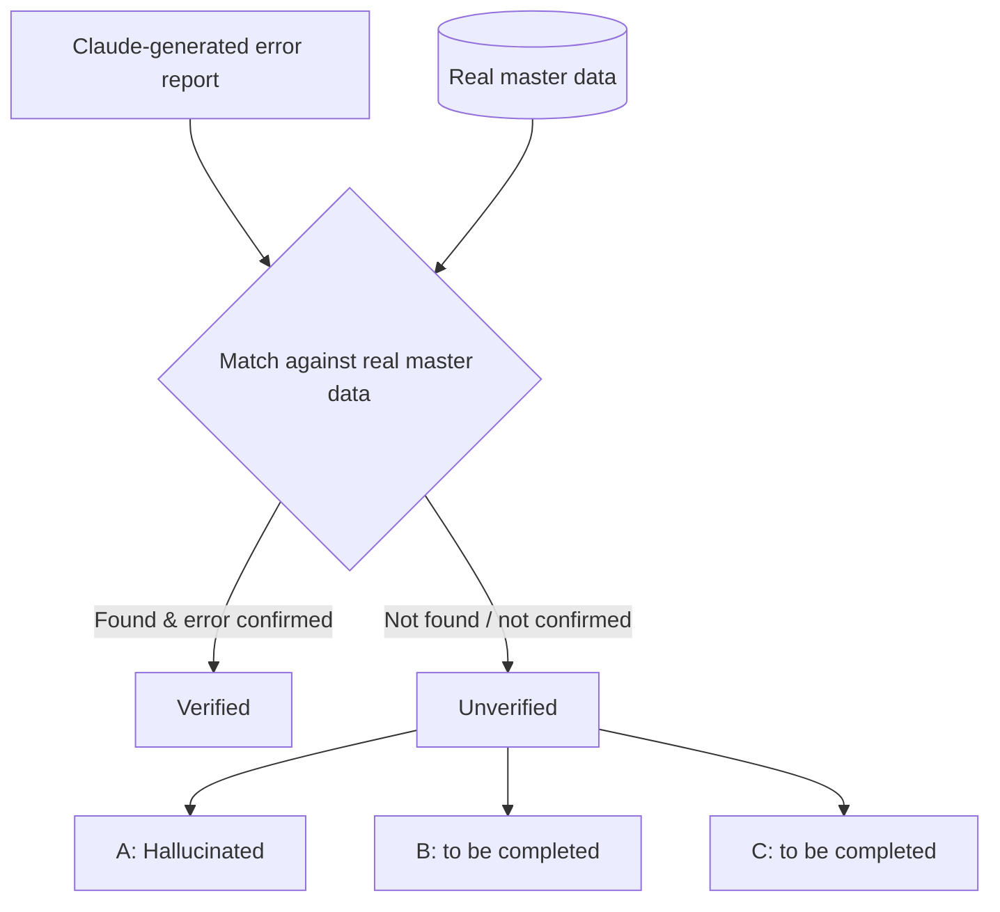
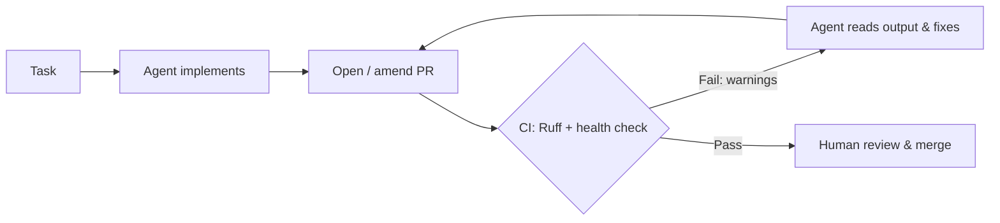

# Knowledge Transfer Session — 6 October 2026

**Master Data Analysis with LLMs & AI-Ready Python Engineering**

| | |
|---|---|
| **Date** | 6 October 2026 |
| **Duration** | 2 h 30 min |
| **Mentor** | Ilhan (Senior Engineer) |
| **Mentee** | Dino (Junior Engineer) |
| **Client / Context** | ICA Gruppen, via Zendev Nordic |
| **Programme** | 6-month senior → junior knowledge transfer |

> **Summary.** The session combined a hands-on case study — validating an LLM-generated report about errors in master data against the real dataset — with a broader set of practices for building Python projects that AI agents can work on safely: project configuration with `pyproject.toml`, linting with Ruff, code-health analysis, CI/CD as an automated feedback loop for agents, and practical lessons on how Claude behaves in agentic workflows.

---

## Table of Contents

1. [Key Takeaways](#1-key-takeaways)
2. [Case Study: Master Data Analysis with LLMs](#2-case-study-master-data-analysis-with-llms)
3. [Working Effectively with Claude and AI Agents](#3-working-effectively-with-claude-and-ai-agents)
4. [Python Project Standards and Tooling](#4-python-project-standards-and-tooling)
5. [CI/CD as a Feedback Loop for AI Agents](#5-cicd-as-a-feedback-loop-for-ai-agents)
6. [Documentation: Why LaTeX](#6-documentation-why-latex)
7. [Open Items and Next Steps](#7-open-items-and-next-steps)

---

## 1. Key Takeaways

- **Never trust an LLM report without grounding it in the source of truth.** Every finding must be traced back to the real data before it is acted on.
- **Context is engineered, not accidental.** Even folder names act as context that steers Claude's behaviour.
- **Models are biased towards their own output.** Claude tends to trust work attributed to Claude more than work attributed to another model — cross-validation must account for that.
- **Agents need guardrails.** Pinned dependencies, linters and health checks in CI turn an agent's mistakes into machine-readable signals it can fix by itself.
- **AI-generated code can still be human-maintainable** — if structure and quality are enforced automatically.
- **Session economics matter.** Continuous, uninterrupted LLM sessions are cheaper because of prompt caching.

---

## 2. Case Study: Master Data Analysis with LLMs

### 2.1 Problem

We had two inputs:

1. **An error report generated by Claude**, listing records in the master data that it flagged as incorrect.
2. **The actual master data** from the source system.

The goal was to determine how much of the LLM-generated report could be trusted and to classify every finding.

### 2.2 Method

**Step 1 — Split findings into Verified and Unverified.**

| Category | Definition |
|---|---|
| **Verified** | The record exists in the real data, the error is genuinely present, and it matches what the report describes. |
| **Unverified** | The finding could not be located or confirmed in the real database. |

**Step 2 — Split the Unverified findings into three subsets** to understand *why* they could not be confirmed:

| Subset | Description |
|---|---|
| **A — Hallucinated** | The model invented records or errors that do not exist in the data. |
| **B** | *To be completed.* |
| **C** | *To be completed.* |



### 2.3 Lessons Learned

- An LLM report is a **hypothesis generator**, not a verdict. Its value comes from narrowing down where a human (or a deterministic script) should look.
- Verification should be **deterministic wherever possible** — direct lookups and joins against the database rather than asking another LLM "is this right?".
- Measuring the share of verified vs. hallucinated findings gives a concrete **precision metric** for the LLM's output, which can be tracked as prompts and pipelines improve.
- Because of the self-trust bias (see §3.3), Claude should not be asked to judge its own report while being told that the report came from Claude.

---

## 3. Working Effectively with Claude and AI Agents

### 3.1 Folder Names Are Context

Claude reads the project structure as part of its context. Descriptive, meaningful folder names (e.g. `master-data-validation/` instead of `test2/`) **reinforce the task intent** and measurably improve output quality. Naming is a free, low-effort form of prompt engineering.

### 3.2 Sub-Agent Configuration

Higher-tier models used in agentic mode (e.g. Claude Fable on a Max plan) can spawn **a large number of sub-agents** on their own. Left unconfigured, this:

- increases cost and token usage,
- makes the run harder to follow and debug,
- can lead to duplicated or conflicting work between sub-agents.

**Practice:** explicitly configure how many sub-agents may run and when delegation is appropriate, rather than relying on defaults.

### 3.3 Self-Trust Bias

Claude tends to **trust output attributed to itself more than output attributed to other LLMs**. If you tell it "Claude produced this", it is more likely to accept the content as correct.

**Implications:**

- For reviews and cross-validation, present content **neutrally** — without saying which model produced it.
- Prefer deterministic checks (tests, queries, linters) over LLM self-review for anything critical.

### 3.4 Environment and Language Choices

- **AI writes Python better** than most other languages — it is heavily represented in training data and has a mature tooling ecosystem.
- **Claude works considerably better on Linux.** Shell commands, paths and tooling behave predictably, and most agent tooling is built Linux-first.

### 3.5 Cost Efficiency: Long-Running Sessions

LLM providers cache the prompt prefix of a session for a short period. Requests that reuse a cached prefix are billed at a fraction of the normal input price and respond faster.

- **Continuous work** keeps the cache warm — every request refreshes it.
- **Working in bursts with long breaks** lets the cache expire, so the full context has to be processed (and paid for) again.

> Anthropic's prompt cache has a default lifetime of **5 minutes** (refreshed on every cache hit), with an optional **1-hour** cache available at a higher write cost.

**Practice:** plan focused, uninterrupted working blocks for long agentic tasks.

---

## 4. Python Project Standards and Tooling

### 4.1 `pyproject.toml` — the Industry Standard

`pyproject.toml` (standardised in PEP 518 and PEP 621) is the single source of truth for a Python project: metadata, dependencies with versions, and configuration for tools such as Ruff, pytest and mypy.

Because Python is an **interpreted, not a compiled, language**, there is no compiler to catch mistakes before runtime. This makes static tooling configured in `pyproject.toml` — linters, type checkers, health checks — much more important.

```toml
[project]
name = "master-data-validation"
version = "0.1.0"
requires-python = ">=3.12"
dependencies = [
    "pandas==2.2.3",
    "pydantic==2.9.2",
]

[project.optional-dependencies]
dev = ["ruff", "pytest"]

[tool.ruff]
line-length = 100
target-version = "py312"

[tool.ruff.lint]
select = ["E", "F", "I", "B", "UP"]   # pycodestyle, pyflakes, isort, bugbear, pyupgrade
```

### 4.2 Virtual Environments and Pinned Dependencies

The virtual environment is built **from `pyproject.toml`**, so every developer — and every agent — gets the same versions.

```bash
python -m venv .venv
source .venv/bin/activate
pip install -e ".[dev]"
```

**Why pinning matters with agents:** an agent may silently bump a dependency version while "fixing" something. That can introduce breaking changes across the codebase. With pinned versions under version control, **any change is visible in the diff** and can be detected and reviewed (or blocked in CI).

### 4.3 PEP Standards

Python's coding standards come from **PEPs (Python Enhancement Proposals)**. The most important for day-to-day work:

| PEP | Topic |
|---|---|
| **PEP 8** | Style guide for Python code — naming, layout, line length, imports |
| **PEP 257** | Docstring conventions |
| **PEP 484** | Type hints |

### 4.4 Ruff — Linter and Formatter

**Ruff** is a very fast Python linter and formatter (written in Rust) that enforces PEP 8 and hundreds of other rules — for example, flagging an overly long string or line (`E501 line-too-long`).

```bash
ruff check .          # lint
ruff check . --fix    # auto-fix where possible
ruff format .         # format
```

Ruff's real power appears when it is used as a **rule in the CI/CD pipeline** (see §5).

### 4.5 Code-Health Analysis

A code-health analyzer computes how **healthy** a Python repository is across several dimensions:

| Dimension | What it measures |
|---|---|
| **Maintainability** | How easy the code is to change safely (complexity, size, duplication) |
| **Readability** | How easy the code is to understand |
| **Coupling** | How dependent modules are on one another, including **cyclic dependencies** (A → B → A) |

Added to CI, it gives the agent a measurable target: the bot fixes whatever lowers the score. The result is code that is **AI-generated but still human-readable and maintainable**.

---

## 5. CI/CD as a Feedback Loop for AI Agents

### 5.1 The Self-Correcting Pull Request Loop

When linters and health checks run in CI, an agent can see failures **programmatically** and fix them without human intervention:

1. The bot receives a task and implements it.
2. It opens a **pull request**.
3. The CI pipeline runs Ruff (and the health check).
4. If a rule is violated, the pipeline **fails** with a warning.
5. The agent reads the failure output, fixes the code and **amends the PR**.
6. The loop repeats until the pipeline passes — then a human reviews.



Example GitHub Actions step:

```yaml
name: CI
on: [pull_request]
jobs:
  lint:
    runs-on: ubuntu-latest
    steps:
      - uses: actions/checkout@v4
      - uses: actions/setup-python@v5
        with:
          python-version: "3.12"
      - run: pip install ruff
      - run: ruff check . --output-format=github
      - run: ruff format --check .
```

### 5.2 Dependabot

**Dependabot** (GitHub) continuously scans a project's dependencies — for example, the packages of a Node.js project — and automatically opens pull requests when:

- a dependency has a **reported vulnerability** (security updates), or
- a **newer version** is available (version updates).

It is rule-based rather than an LLM, but in practice it behaves like a small assistant that **works continuously in the background**, keeping dependencies current without anyone having to remember to check.

---

## 6. Documentation: Why LaTeX

For generating reports and PDFs, **LaTeX** was recommended over both Word and Python PDF libraries.

### 6.1 LaTeX vs. Word

In Word, moving one element can shift the entire layout. In LaTeX, **content and layout are separated** — the document is plain text and the typesetting engine handles placement deterministically.

### 6.2 LaTeX vs. Python PDF Libraries

| Aspect | LaTeX | Python PDF libraries (e.g. ReportLab, FPDF) |
|---|---|---|
| **Layout** | Automatic: pagination, floats, line breaking | Mostly manual: coordinates, page breaks handled in code |
| **Typography** | Professional-grade line breaking, hyphenation, kerning | Basic text placement |
| **Structure** | Built-in sections, TOC, cross-references, citations, numbering | Must be implemented by hand |
| **Math & tables** | Best-in-class | Limited |
| **Version control** | Plain text → clean `git diff`s and reviews | Layout logic mixed with application code |
| **Reproducibility** | Same source → same PDF; easy to build in CI | Depends on code and library versions |
| **LLM-friendliness** | LLMs write LaTeX well, and output is easy to review | More code to generate and debug |

**Bottom line:** LaTeX produces consistent, professional documents from plain text that fits naturally into Git-based and AI-assisted workflows.

---

## 7. Open Items and Next Steps

- [ ] Complete the definitions of Unverified subsets **B** and **C** (§2.2).
- [ ] Add Ruff and a code-health check to the project's CI pipeline.
- [ ] Review sub-agent configuration for agentic runs.
- [ ] Try generating the next session report with LaTeX.

---

*Knowledge transfer series · Zendev Nordic × ICA Gruppen · Session of 6 October 2026*
